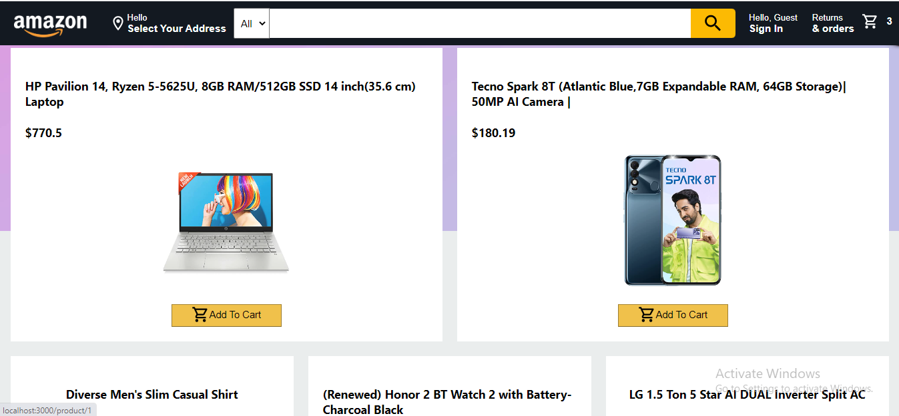

# Amazon-Clone

Amazon.com, Inc. is an American multinational technology company which focuses on e-commerce, cloud computing, digital streaming, and artificial intelligence. It has been referred to as "one of the most influential economic and cultural forces in the world", and is one of the world's most valuable brands.

## Tech Stack

 
<ul>
<li>HTML5</li>
<li>CSS3</li>
<li>JavaScript</li>
<li>ReactJs</li>
<li>Redux</li>
<li>Material-UI</li>
<li>Firebase</li>
</ul>

 

## Demo Look

 

 

 

 

## Challenges

In this project I learned lot of things but somewhere I struggle because the kind of syntax in React Redux is 
different. So finally, it build confidence in me on how to use this library. I faced a probem in User Authentication part because I want to use Firebase this time to handle the login and signup part.

The feeling of completing the project was very satisfying. Hard work pays off. So, in all this is a great and wonderful experience for me.

Thank you !
